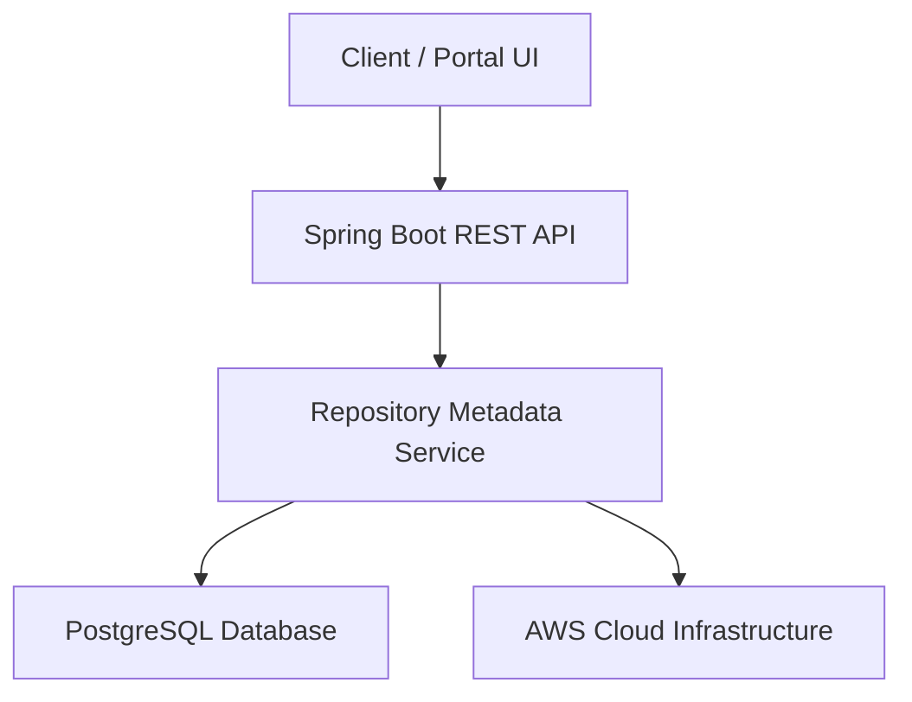

# Elitea-Repository

Enterprise-grade backend service for centralized repository metadata management, automated application synchronization, and version governance across cloud environments.

## Overview

Elitea-Repository is a Java 17 and Spring Boot based backend application that provides centralized management of repository metadata, automated synchronization capabilities, compliance tracking, and repository governance across cloud environments.

The platform enables internal developers and administrators to manage repository configurations, monitor repository health, trigger synchronization processes, and maintain consistent version governance across the organization.

---

## Service Information

**Application Name:** Elitea-Repository

**Service Owner:** Gaurav Agarwal (gaurav_agarwal@epam.com)

**Business Impact:** Critical

**Current Version:** v1.0.0

**Last Updated:** 2026-09-30

---

## Architecture



---

## Technology Stack

### Backend
- Java 17
- Spring Boot 3.2.5
- Spring Data JPA

### Database
- PostgreSQL

### Infrastructure
- AWS
- Docker
- Kubernetes (EKS)

### Build & CI/CD
- Maven
- GitHub Actions

### Quality & Security
- JUnit 5
- Mockito
- SonarQube
- Snyk

### Monitoring & Observability
- Datadog
- Spring Boot Actuator
- SLF4J

---

## System Dependencies

### Upstream Services
- Auth Service
- Configuration Server

### Downstream Consumers
- Elitea Portal UI
- CLI Sync Tool

### External APIs
- None

---

## Repository Information

### Git Repository

```text
https://github.com/gauravqait/Elitea-Repository
```

### Default Branch

```text
main
```

### Project Structure

```text
Elitea-Repository
│
├── src
│   ├── main
│   │   ├── java
│   │   │   └── com/example/elitea/
│   │   │       └── EliteaRepositoryApplication.java
│   │   └── resources
│   │
│   └── test
│
├── pom.xml
├── Dockerfile
├── .github/workflows
└── README.md
```

---

## Build & Run

### Build Application

```bash
mvn clean install
```

### Run Application

```bash
mvn spring-boot:run
```

### Run Tests

```bash
mvn test
```

### Generate Package

```bash
mvn clean package
```

---

## Configuration

### Required Environment Variables

| Variable | Description |
|-----------|-------------|
| SPRING_DATASOURCE_URL | PostgreSQL connection URL |
| SPRING_DATASOURCE_USERNAME | Database username |
| SPRING_DATASOURCE_PASSWORD | Database password |
| SERVER_PORT | Server port |

### Example Configuration

```bash
export SPRING_DATASOURCE_URL=jdbc:postgresql://localhost:5432/elitea
export SPRING_DATASOURCE_USERNAME=postgres
export SPRING_DATASOURCE_PASSWORD=password
export SERVER_PORT=8080
```

---

## API Endpoints

### Get All Repository Metadata

```http
GET /api/v1/repository/all
```

Returns all repository metadata records.

### Trigger Repository Synchronization

```http
POST /api/v1/repository/sync
```

Starts the automated synchronization process.

### Health Check

```http
GET /api/v1/repository/health
```

Returns application and actuator health status.

---

## Deployment

### CI/CD Pipeline

GitHub Actions performs:

- Source code validation
- Automated testing
- SonarQube analysis
- Security scanning
- Docker image generation
- Kubernetes deployment

### Deployment Target

```text
AWS Elastic Kubernetes Service (EKS)
```

### Container Platform

```text
Docker
```

---

## Quality Standards

### Testing

- Framework: JUnit 5
- Mocking: Mockito
- Target Code Coverage: 80%

### Static Analysis

- SonarQube

### Security

- Snyk Vulnerability Scanning

### Observability

- Datadog Monitoring
- Spring Boot Actuator
- SLF4J Logging

---

## Monitoring

### Health Endpoint

```http
GET /api/v1/repository/health
```

### Logging Features

- Application Logs
- Error Logs
- Audit Logs
- Synchronization Activity Logs

---

## Security

Security controls implemented include:

- Centralized Authentication Integration
- Role Based Access Control (RBAC)
- Secure Database Access
- Continuous Vulnerability Scanning
- Static Code Analysis
- Container Security Checks

### Security Best Practices

- Never commit credentials to source control.
- Store secrets using secure secret management solutions.
- Enable TLS for all external communications.
- Rotate credentials regularly.

---

## Documentation

### Application Repository

https://github.com/gauravqait/Elitea-Repository

### Additional Resources

- Swagger API Documentation
- Confluence Documentation
- JIRA Project Board
- PagerDuty On-Call Support

---

## Support

**Primary Owner:** Gaurav Agarwal

**Email:** gaurav_agarwal@epam.com

### Operational Support

- Development Team
- GitHub Actions Pipeline Monitoring
- Datadog Monitoring
- PagerDuty On-Call Rotation

---

## Version History

| Version | Date | Description |
|----------|------------|-------------|
| v1.0.0 | 2026-09-30 | Initial Release |

---

## License

Proprietary Internal Application

This repository contains confidential enterprise software intended for authorized organizational use only.

---

## Status

✅ Production Ready

Managed through automated synchronization and governance workflows within the EliteA ecosystem.
