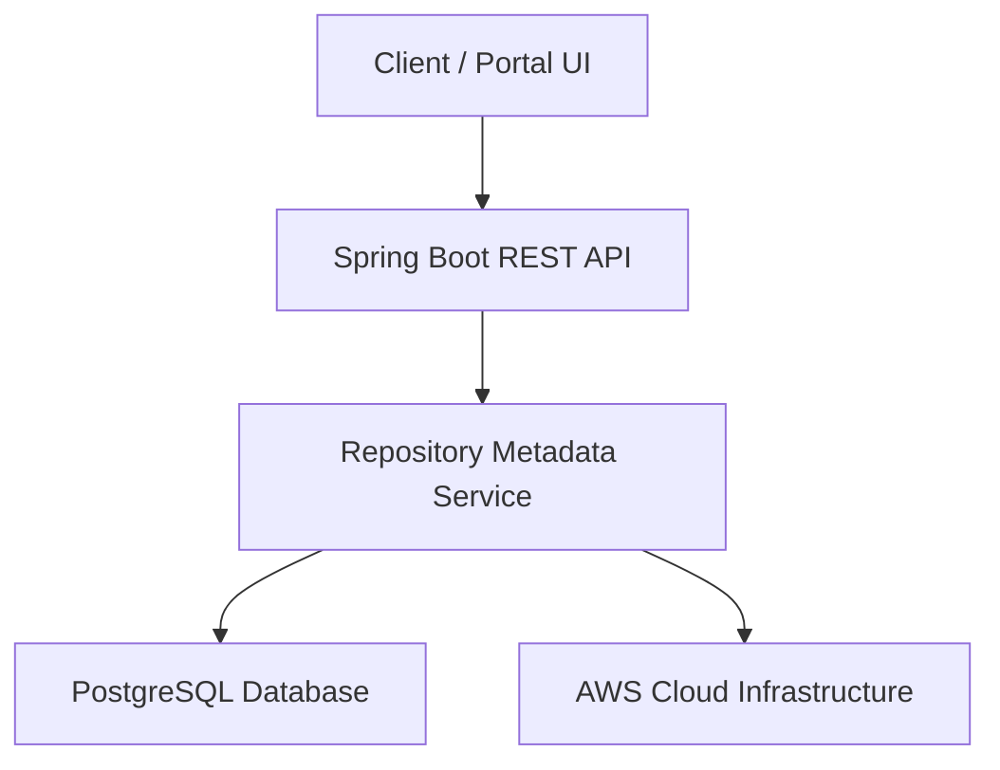

# Elitea-Repository

Enterprise-grade backend service for centralized repository metadata management, automated application synchronization, and version governance across cloud environments.

https://img.shields.io/badge/Java-17-blue
https://img.shields.io/badge/Spring%20Boot-3.2.5-green
https://img.shields.io/badge/PostgreSQL-Database-blue
https://img.shields.io/badge/AWS-Cloud-orange
https://img.shields.io/badge/Docker-Containerization-blue
![Kubernetesshields.io/badge/Kubernetes-EKS-blue

---

## Overview

Elitea-Repository is an enterprise-grade backend application built using Java 17 and Spring Boot. The platform provides centralized repository metadata management, automated application synchronization, repository governance, and compliance tracking capabilities across cloud environments.

The service enables development teams and administrators to manage repository configurations, monitor repository health, automate synchronization workflows, and maintain governance standards throughout the software delivery lifecycle.

---

## Service Information

| Property | Value |
|-----------|---------|
| Application Name | Elitea-Repository |
| Service Owner | Gaurav Agarwal |
| Email | gaurav_agarwal@epam.com |
| Business Impact | Critical |
| Version | v1.0.0 |
| Deployment | Production |
| Last Updated | 2026-09-30 |

---

## Architecture



### System Flow

1. Client applications invoke REST APIs.
2. Spring Boot processes incoming requests.
3. Repository Metadata Service executes business logic.
4. Data is persisted in PostgreSQL.
5. Synchronization activities interact with AWS infrastructure.
6. Results are returned to consumers.

---

## Technology Stack

### Backend

- Java 17
- Spring Boot 3.2.5
- Spring Data JPA

### Database

- PostgreSQL

### Infrastructure

- AWS
- Docker
- Kubernetes (Amazon EKS)

### Build & Dependency Management

- Maven

### CI/CD

- GitHub Actions

### Testing

- JUnit 5
- Mockito

### Quality & Security

- SonarQube
- Snyk

### Monitoring & Logging

- Datadog
- Spring Boot Actuator
- SLF4J

---

## Repository Structure

```text
Elitea-Repository
│
├── src
│   ├── main
│   │   ├── java
│   │   │   └── com/example/elitea
│   │   │       └── EliteaRepositoryApplication.java
│   │   └── resources
│   │
│   └── test
│
├── .github
│   └── workflows
│
├── pom.xml
├── Dockerfile
└── README.md
```

---

## Dependencies

### Upstream Dependencies

- Auth Service
- Configuration Server

### Downstream Consumers

- Elitea Portal UI
- CLI Sync Tool

### External APIs

- None

---

## Build Instructions

### Clone Repository

```bash
git clone https://github.com/gauravqait/Elitea-Repository.git
cd Elitea-Repository
```

### Build Application

```bash
mvn clean install
```

### Run Unit Tests

```bash
mvn test
```

### Package Application

```bash
mvn clean package
```

### Run Locally

```bash
mvn spring-boot:run
```

---

## Application Entry Point

```text
src/main/java/com/example/elitea/EliteaRepositoryApplication.java
```

---

## Environment Variables

The following environment variables are required before application startup:

```bash
SPRING_DATASOURCE_URL
SPRING_DATASOURCE_USERNAME
SPRING_DATASOURCE_PASSWORD
SERVER_PORT
```

### Example

```bash
export SPRING_DATASOURCE_URL=jdbc:postgresql://localhost:5432/elitea
export SPRING_DATASOURCE_USERNAME=postgres
export SPRING_DATASOURCE_PASSWORD=password
export SERVER_PORT=8080
```

---

## REST API Endpoints

### Retrieve Repository Metadata

```http
GET /api/v1/repository/all
```

Returns all repository metadata records.

---

### Trigger Synchronization

```http
POST /api/v1/repository/sync
```

Triggers automated application synchronization workflow.

---

### Health Check

```http
GET /api/v1/repository/health
```

Returns application health and actuator status.

---

## Deployment

### Source Branch

```text
main
```

### CI/CD Pipeline

GitHub Actions performs:

- Source validation
- Application build
- Unit test execution
- Quality analysis
- Security scanning
- Docker image creation
- Kubernetes deployment

### Deployment Platform

```text
AWS Elastic Kubernetes Service (EKS)
```

### Container Runtime

```text
Docker
```

---

## Quality Standards

### Test Frameworks

- JUnit 5
- Mockito

### Coverage Goal

```text
80%
```

### Static Analysis

- SonarQube

### Security Scanning

- Snyk

### Build Requirements

- Successful build
- Successful test execution
- Minimum coverge threshold met
- No critical SonarQube issues
- No high severity security defects

---

## Observability

### Monitoring

- Datadog

### Application Health

- Spring Boot Actuator

### Logging

- SLF4J

### Health Endpoint

```http
GET /api/v1/repository/health
```

---

## Security

Implemented security capabilities include:

- Authentication service integration
- Repository governance controls
- Secure database connectivity
- Vulnerability scanning
- Static code analysis
- Audit logging
- Container security validation

### Security Recommendations

- Do not commit secrets to source control.
- Use encrypted secret stores.
- Enable TLS for all communications.
- Rotate credentials periodically.
- Regularly review vulnerability reports.

---

## Documentation

### GitHub Repository

```text
https://github.com/gauravqait/Elitea-Repository
```

### Additional Resources

#### API Documentation

```text
https://confluence.example.com/docs/elitea-repo
```

#### JIRA Board

```text
https://jira.example.com/projects/ELITEA
```

#### On-Call Support

```text
https://pagerduty.example.com/teams/elitea
```

---

## Operational Support

### Service Owner

**Gaurav Agarwal**  
gaurav_agarwal@epam.com

### Support Channels

- Development Team
