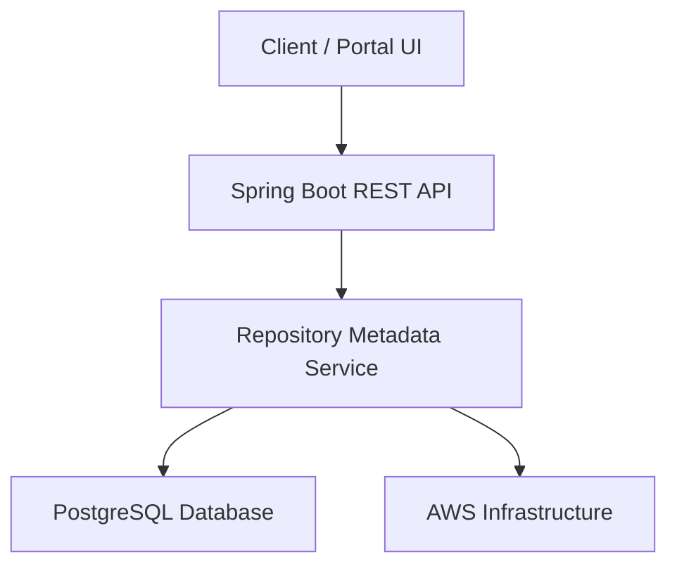

# Elitea-Repository

Enterprise-grade backend service for centralized repository metadata management, automated application synchronization, compliance tracking, and version governance across cloud environments.

---

## Overview

Elitea-Repository is a Java 17 and Spring Boot based application that provides a centralized platform for managing repository metadata and synchronization workflows across enterprise environments.

Key capabilities include:

- Repository metadata management
- Automated synchronization workflows
- Repository governance and compliance tracking
- Centralized configuration management
- Cloud-native deployment on AWS
- REST API access for internal consumers

---

## Application Information

| Property | Value |
|-----------|---------|
| Application Name | Elitea-Repository |
| Service Owner | Gaurav Agarwal |
| Contact | gaurav_agarwal@epam.com |
| Current Version | v1.0.0 |
| Business Impact | Critical |
| Deployment Environment | AWS EKS |
| Last Updated | 2026-09-30 |

---

## Architecture



### Architecture Components

- Client Portal UI
- Spring Boot REST API Layer
- Repository Metadata Service
- PostgreSQL Database
- AWS Cloud Infrastructure
- Kubernetes (EKS)
- Docker Containers

---

## Technology Stack

### Backend

- Java 17
- Spring Boot 3.2.5
- Spring Data JPA

### Database

- PostgreSQL

### Infrastructure

- AWS
- Docker
- Kubernetes (EKS)

### Build & Dependency Management

- Maven

### CI/CD

- GitHub Actions

### Testing

- JUnit 5
- Mockito

### Security & Quality

- SonarQube
- Snyk

### Monitoring

- Datadog
- Spring Boot Actuator
- SLF4J

---

## Repository

### Source Code

```text
https://github.com/gauravqait/Elitea-Repository
```

### Default Branch

```text
main
```

---

## Project Structure

```text
Elitea-Repository
│
├── src
│   ├── main
│   │   ├── java
│   │   │   └── com/example/elitea
│   │   │       └── EliteaRepositoryApplication.java
│   │   └── resources
│   │
│   └── test
│
├── .github
│   └── workflows
│
├── pom.xml
├── Dockerfile
└── README.md
```

---

## Dependencies

### Upstream Dependencies

- Auth Service
- Configuration Server

### Downstream Consumers

- Elitea Portal UI
- CLI Sync Tool

### External APIs

- None

---

## Build Instructions

### Clone Repository

```bash
git clone https://github.com/gauravqait/Elitea-Repository.git
cd Elitea-Repository
```

### Build

```bash
mvn clean install
```

### Run Tests

```bash
mvn test
```

### Package

```bash
mvn clean package
```

### Run Application

```bash
mvn spring-boot:run
```

---

## Application Entry Point

```java
src/main/java/com/example/elitea/EliteaRepositoryApplication.java
```

---

## Configuration

### Environment Variables

```bash
SPRING_DATASOURCE_URL
SPRING_DATASOURCE_USERNAME
SPRING_DATASOURCE_PASSWORD
SERVER_PORT
```

### Example

```bash
export SPRING_DATASOURCE_URL=jdbc:postgresql://localhost:5432/elitea
export SPRING_DATASOURCE_USERNAME=postgres
export SPRING_DATASOURCE_PASSWORD=password
export SERVER_PORT=8080
```

---

## REST APIs

### Get All Repositories

```http
GET /api/v1/repository/all
```

Returns repository metadata records.

---

### Trigger Synchronization

```http
POST /api/v1/repository/sync
```

Starts repository synchronization workflow.

---

### Health Check

```http
GET /api/v1/repository/health
```

Returns application health status.

---

## Deployment

### Platform

- AWS
- Docker
- Kubernetes (EKS)

### Continuous Integration

GitHub Actions performs:

- Build validation
- Unit testing
- Static code analysis
- Security scanning
- Container image build
- Deployment automation

---

## Quality Standards

### Testing Frameworks

- JUnit 5
- Mockito

### Coverage Goal

```text
80%
```

### Static Analysis

- SonarQube

### Security Validation

- Snyk

---

## Monitoring & Observability

### Monitoring

- Datadog

### Logging

- SLF4J

### Health Monitoring

- Spring Boot Actuator

### Health Endpoint

```http
GET /api/v1/repository/health
```

---

## Security

Implemented security controls include:

- Authentication integration
- Access control enforcement
- Secure database connectivity
- Continuous vulnerability scanning
- Code quality validation
- Audit logging

### Best Practices

- Never commit secrets to source control.
- Store sensitive data in secure secret stores.
- Enable TLS for external communication.
- Rotate credentials regularly.

---

## Support

### Service Owner

**Gaurav Agarwal**

Email: gaurav_agarwal@epam.com

### Support Channels

- Development Team
- GitHub Actions Monitoring
- Datadog Monitoring
- PagerDuty On-Call

---

## Documentation

### Repository

https://github.com/gauravqait/Elitea-Repository

### Additional Resources

- Confluence Documentation
- Swagger API Documentation
- JIRA Project Board
- PagerDuty On-Call

---

## Release History

| Version | Date | Description |
|---------|---------|---------|
| v1.0.0 | 2026-09-30 | Initial Enterprise Release |

---

## License

Internal Enterprise Application

This repository contains proprietary and confidential information intended for authorized organizational use only.

---

## Status

✅ Production Ready

Managed through the EliteA ecosystem for repository governance, metadata management, synchronization, and compliance monitoring.
