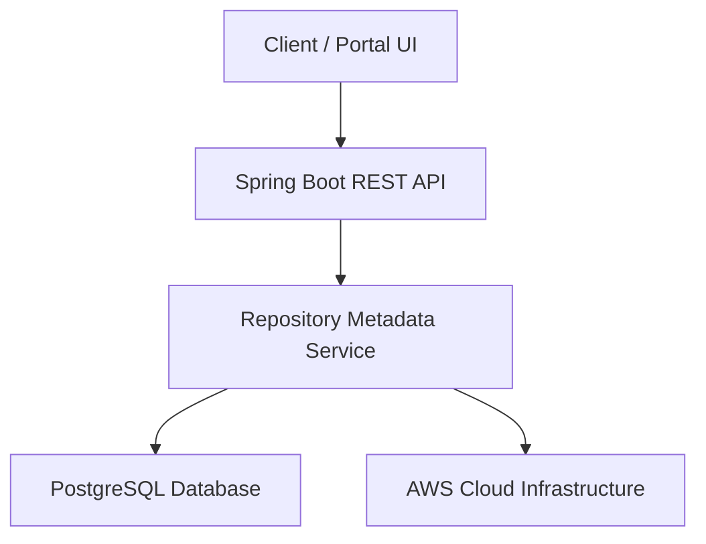

# ELITEA_Repository

> **Current Version:** v.1.0.0  
> **Last Updated:** 2026-09-30 (via EliteA Automated Sync)

---

## Application Name
ELITEA_Repository

---

## Project Overview
ELITEA_Repository is an enterprise-grade backend service built on Java 17 and Spring Boot to manage centralized repository metadata, automated application synchronization, and version governance across cloud environments. It serves internal developers and administrators by providing robust API access to repository configurations, compliance tracking, and automated sync pipelines.

---

## System Architecture
The system follows a microservices architecture pattern, containerized using Docker and orchestrated via Kubernetes on AWS cloud infrastructure.

Tech Stack
Component	Specification
Language/Runtime	Java 17
Frameworks	Spring Boot 3.2.5, Spring Data JPA
Primary Database	PostgreSQL
Cloud Provider	AWS
Infrastructure	Docker, Kubernetes

Endpoint/Entry Points
The application runs as a Spring Boot web application. Below are the primary execution files and documented REST API routes:

Main Execution File: src/main/java/com/example/elitea/EliteaRepositoryApplication.java
API Endpoints Documentation
GET /api/v1/repository/all
Description: Retrieve all repository metadata records.
Parameters: None
Response: JSON array of repository objects.
POST /api/v1/repository/sync
Description: Trigger automated application synchronization.
Parameters: Repository ID (JSON Body)
Response: Status 200 OK with sync summary.
GET /api/v1/repository/health
Description: Health check and Actuator status endpoint.
Parameters: None

Environment Config
To run this application locally or in a containerized environment, the following configuration variables and system dependencies must be set:
# Database Configuration
SPRING_DATASOURCE_URL=jdbc:postgresql://localhost:5432/elitea_db
SPRING_DATASOURCE_USERNAME=postgres
SPRING_DATASOURCE_PASSWORD=secure_password

# Server Configuration
SERVER_PORT=8080

# Management & Actuator
MANAGEMENT_ENDPOINTS_WEB_EXPOSURE_INCLUDE=health,metrics,info

Maintainers
Primary Owner: Your Name (gaurav_agarwal@epam.com)
Team: ELITEA Core Infrastructure Team

Additional Resources
GitHub Repository: https://github.com/example/ELITEA_Repository
JIRA Board: https://jira.example.com/projects/ELITEA
On-Call Rotation: https://pagerduty.example.com/teams/elitea
